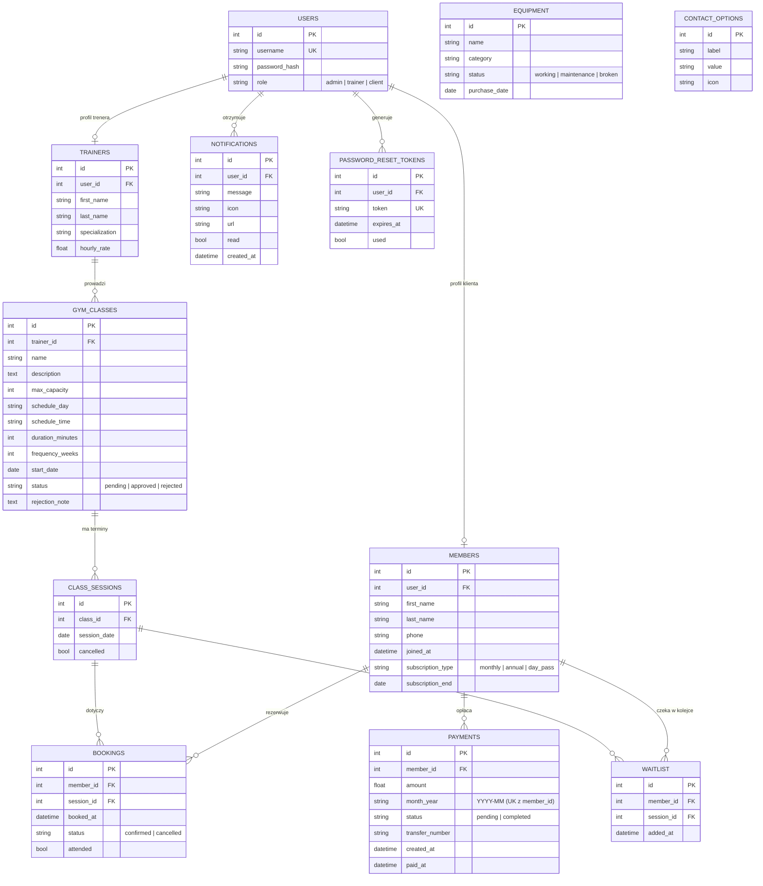

# 🗃️ Schemat bazy danych — GymManagement

Diagram związków encji (ERD) wygenerowany na podstawie modeli SQLAlchemy (`models.py`).
**12 tabel.** Diagram renderuje się automatycznie na GitHubie.

---

## Opis relacji

| Relacja | Typ | Klucz obcy | Kaskada usuwania |
|---------|-----|-----------|------------------|
| `User` → `Member` | 1 : 0..1 | `members.user_id` | ✅ delete-orphan |
| `User` → `Trainer` | 1 : 0..1 | `trainers.user_id` | ✅ delete-orphan |
| `User` → `Notification` | 1 : N | `notifications.user_id` | ✅ delete-orphan |
| `User` → `PasswordResetToken` | 1 : N | `password_reset_tokens.user_id` | ✅ delete-orphan |
| `Trainer` → `GymClass` | 1 : N | `gym_classes.trainer_id` | — |
| `GymClass` → `ClassSession` | 1 : N | `class_sessions.class_id` | ✅ delete-orphan |
| `Member` → `Booking` | 1 : N | `bookings.member_id` | ✅ delete-orphan |
| `ClassSession` → `Booking` | 1 : N | `bookings.session_id` | ✅ delete-orphan |
| `Member` → `WaitlistEntry` | 1 : N | `waitlist.member_id` | ✅ delete-orphan |
| `ClassSession` → `WaitlistEntry` | 1 : N | `waitlist.session_id` | ✅ delete-orphan |
| `Member` → `Payment` | 1 : N | `payments.member_id` | ✅ delete-orphan |

**Tabele bez relacji (słownikowe):** `Equipment`, `ContactOption`.

**Ograniczenia unikalności:** `users.username`, `password_reset_tokens.token`,
`payments(member_id, month_year)` — jeden wpis płatności na klienta i okres rozliczeniowy.

**Tabela łącząca M:N:** `Booking` i `WaitlistEntry` realizują relację wiele-do-wielu
między `Member` a `ClassSession` (klient ↔ sesja zajęć).
